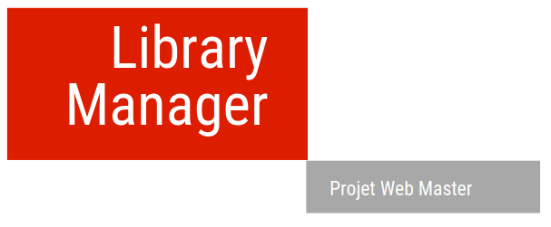
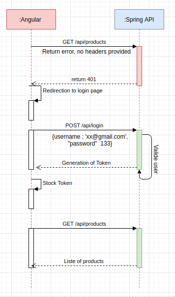

# ```Library Manager ```

## Description
``` 
This project is for Library management, was generated with Angular CLI version 9.1.1 
Node 10.19.0 & Spring Boot & MongoDB  
```
## Perfect Scenario

## Get started
```bash
https://github.com/lindaAcc/ProjetWebMaster.git
cd front
ng serve - > Navigate to localhost:4200
```
## Prerequisites
- `Java 8`
- `NodeJs `
- `Angular 9`
- `Mongo DB`
---
## Authors 
- [Linda Ben boudiaf](https://github.com/lindaAcc)
## Supervisor 
- [Benoit Charroux](https://github.com/charroux)
